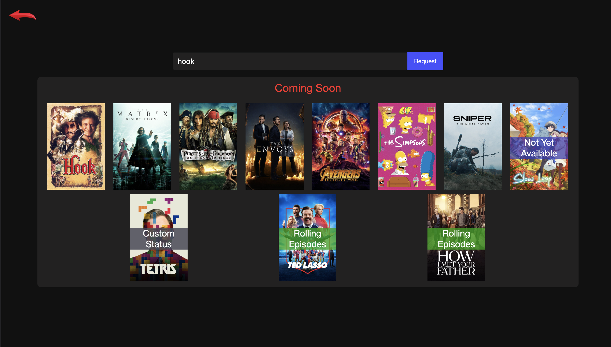

# Streama Support Portal &middot; ![GitHub license][MIT-license-url] ![npm version][NPM-url]
<a name="readme-top"></a>
[![React][React.js]][React-url]
[![Styled Components][Styled-Components]][Styled-Components-url]
[![Node][Node.js]][Node-url]
[![PostgreSQL][PostgreSQL]][PostgreSQL-url]

Media request support service for <a href="https://github.com/streamaserver/streama" target="_blank">Streama App</a>.

<!-- Top-Level App Screenshot -->


<!-- Deployed Site -->
Check out the [deployed site(not yet available)](<url here>)

<!-- TABLE OF CONTENTS -->
## Table of Contents
- [Getting Started](#getting-started)
  - [The Easiest Way(Docker Only)](#the-easiest-way)
  - [Quickstart App with Demo Data(Docker Only)](#quickstart-app-with-demo-datadocker-only)
  - [For Faster Development](#for-faster-development)
- [App Features](#app-features)
- [Special Thanks](#special-thanks)
- [License](#license)

## Getting Started
At the root of your project duplicate the 'sample.env.*' and rename it '.env' (optionally edit any values you would like to change)

### The Easiest Way(Docker Only)
Start with Docker
```sh
docker-compose up
# or when rebuilding
docker-compose up --build
```

### For Faster Development
Run Database with Docker
```sh
docker-compose -f docker-compose-db-only.yml up
```

Setup + Run Server(Node) App
```sh
# from project root
cd ./server
npm install
# migrate database
npm run migrate
npm run start
```

Setup + Run Client(React) App
```sh
# from project root
cd ./client
npm install
npm run start
```

## Features
1. Search MovieDB for movies and shows
2. Request movies and shows

<!-- ## Special Thanks
A quick thanks to sources for learning or sample code that helped us bring this app to life
>  -->

## License
This app is distributed under the terms of the [MIT license](./LICENSE).

<p align="left"><a href="#readme-top">(Back to Top)</a></p>

<!----------- MARKDOWN LINKS & IMAGES --------------->
<!-- BADGE URL SYNTAX  -->
<!--  - title info: [short-link name]: https://img.shields.io/static/v1?label=<left-side-text>&message=<right-side-text>&color=<color>&style=<style-type> -->
<!--  - logo w/link: [short-link name]: https://img.shields.io/badge/<label>-<bg-color?style=<style-type>&logo=<name from simpleicon.org> -->
<!-- RESOURCE LINKS -->
<!--  - markdown links guide: https://www.markdownguide.org/basic-syntax/#reference-style-links -->
<!--  - logo names: https://simpleicons.org/ -->

<!-- Top-Lvl Title -->
[MIT-license-url]: https://img.shields.io/badge/license-MIT-blue.svg
[NPM-url]: https://img.shields.io/static/v1?label=npm&message=v8.19.3&color=blue&style=flat
<!-- Built With -->
[React.js]: https://img.shields.io/badge/React-20232A?style=for-the-badge&logo=react&logoColor=61DAFB
[React-url]: https://reactjs.org/
[Node.js]: https://img.shields.io/badge/Node.js-20232A?style=for-the-badge&logo=node.js
[Node-url]: https://nodejs.org/en/docs
[Styled-Components]: https://img.shields.io/badge/styled_components-20232A?style=for-the-badge&logo=styled-components
[Styled-Components-url]: https://styled-components.com/docs
[PostgreSQL]: https://img.shields.io/badge/PostgreSQL-20232A?style=for-the-badge&logo=PostgreSQL
[PostgreSQL-url]: https://www.postgresql.org/docs/