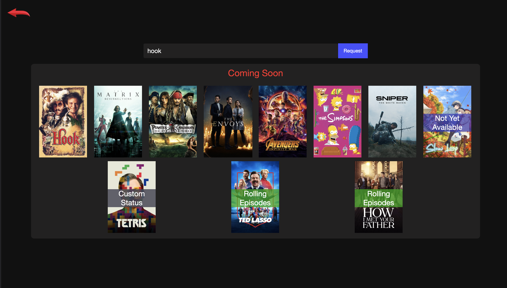

# Streama Support Portal &middot; ![GitHub license][MIT-license-url] ![npm version][NPM-url]
<a name="readme-top"></a>
[![React][React.js]][React-url]
[![Styled Components][Styled-Components]][Styled-Components-url]
[![Node][Node.js]][Node-url]
[![PostgreSQL][PostgreSQL]][PostgreSQL-url]

Media request support service for <a href="https://github.com/streamaserver/streama" target="_blank">Streama App</a>.

<!-- Top-Level App Screenshot -->


## Table of Contents
- [Getting Started](#getting-started)
  - [Docker](#docker)
  - [Local development](#local-development)
- [Documentation](#documentation)
- [App Features](#app-features)
- [License](#license)

## Getting Started

Copy a sample env file to `.env` at the project root and edit values as needed:

```sh
cp sample.env.local .env
```

Set `PIPELINE_API_TOKEN` and `SORTIFY_API_TOKEN` before agents can call `/agent/*`
(see [docs/app.md](./docs/app.md#environment-variables)).

### Docker

```sh
docker-compose up
# or when rebuilding
docker-compose up --build
```

### Local development

```sh
docker-compose -f docker-compose-db-only.yml up
```

```sh
# server (:3000)
cd ./server && npm install && npm run migrate && npm start

# client (:8081)
cd ./client && npm install && npm run start
```

Use `DB_HOST=localhost` in `.env` when Postgres runs in Docker on port 5432.

Deploy: `./scripts/deploy.sh`

## Documentation

| Doc | Description |
|---|---|
| [docs/README.md](./docs/README.md) | Doc index — portal + Prelanflix + Sortify relationship |
| [docs/app.md](./docs/app.md) | App stack, env vars, deploy, API summary |
| [docs/agent-integration-changes/.../overview.md](./docs/agent-integration-changes/00_docs/stream-support-portal-app/overview.md) | Pipeline contract and `/agent/v1` reference |

Related repos (not in this tree):

- Prelanflix pipeline — `~/.cursor/00_docs/` on the download box (`rentify`, encode, sync)
- Sortify agent — `catalog.ssh_alias/agents/sortify-agent/docs/README.md` on the ElanFlix box

## App Features

1. Search TMDB for movies and shows
2. Request movies and shows
3. Automated pipeline integration: movie requests auto-fetch and persist a magnet
   (hourly retry, auto **Not Yet Available** when unreleased and **Check Manually** when released but no source), the Prelanflix
   pipeline claims jobs and reports download/encode/upload progress, and the
   Sortify agent reports sorting/registration and dashboard highlighting — so a
   request tracks all the way to "Available" with no manual media adds.
4. Admin-only, append-only event history for every request (past and present).

**Integration status:** portal and Sortify bridge are implemented; Prelanflix
`portal-worker` is still pending (see [docs/README.md](./docs/README.md)).

## License

This app is distributed under the terms of the [MIT license](./LICENSE).

<p align="left"><a href="#readme-top">(Back to Top)</a></p>

<!----------- MARKDOWN LINKS & IMAGES --------------->
[MIT-license-url]: https://img.shields.io/badge/license-MIT-blue.svg
[NPM-url]: https://img.shields.io/static/v1?label=npm&message=v8.19.3&color=blue&style=flat
[React.js]: https://img.shields.io/badge/React-20232A?style=for-the-badge&logo=react&logoColor=61DAFB
[React-url]: https://reactjs.org/
[Node.js]: https://img.shields.io/badge/Node.js-20232A?style=for-the-badge&logo=node.js
[Node-url]: https://nodejs.org/en/docs
[Styled-Components]: https://img.shields.io/badge/styled_components-20232A?style=for-the-badge&logo=styled-components
[Styled-Components-url]: https://styled-components.com/docs
[PostgreSQL]: https://img.shields.io/badge/PostgreSQL-20232A?style=for-the-badge&logo=PostgreSQL
[PostgreSQL-url]: https://www.postgresql.org/docs/
